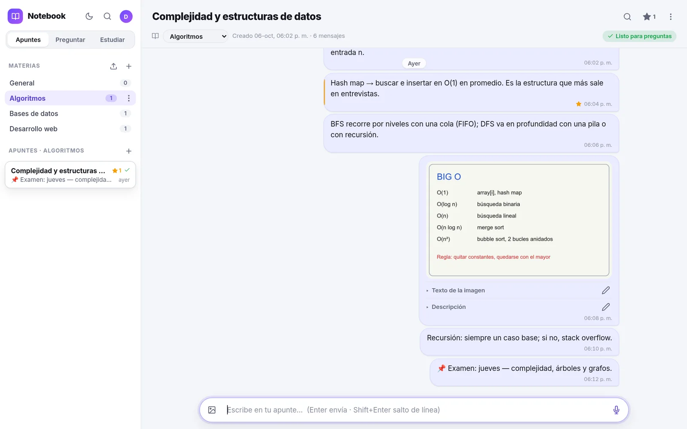
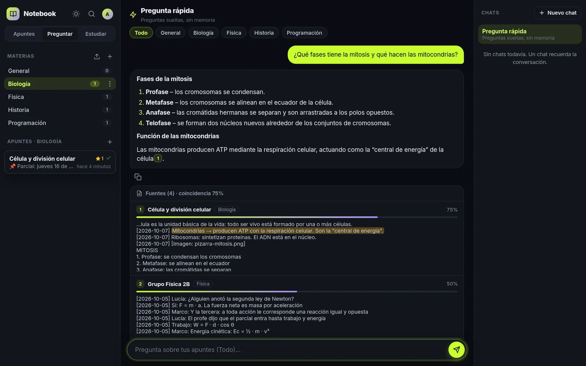
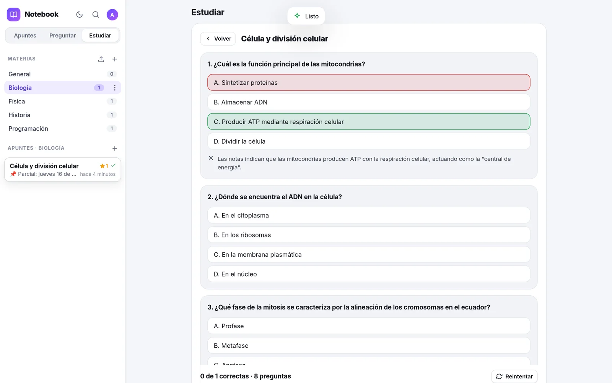
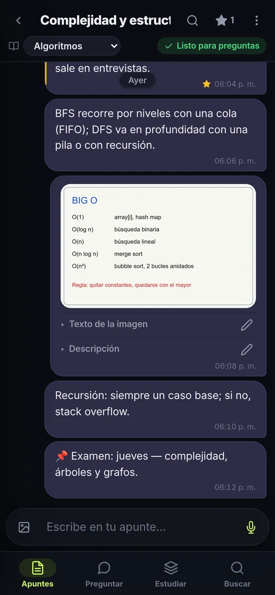
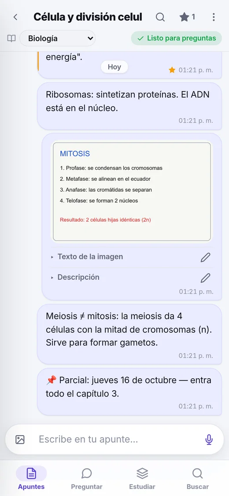

<div align="center">


# Notebook

**Your notes as a chat with yourself — with AI memory.**<br/>
Write, paste, snap the whiteboard or record a voice note. Then ask your notes, search them instantly and study with flashcards made from what *you* wrote.

[](https://github.com/rossmelabasto/ross_notebook/actions/workflows/ci.yml)
[](LICENSE)


[Live demo](https://notebook.rossmel.top) · [Self-hosting](#self-hosting) · [How it works](docs/ARCHITECTURE.md) · [Changelog](CHANGELOG.md) · [Español](README.es.md)

<picture>
  <source media="(prefers-color-scheme: dark)" srcset="docs/screenshots/desktop-dark.webp" />
  
</picture>

</div>

## Features

- **A chat with yourself.** Each note is a thread: text, images and voice notes. Messages appear instantly and are sent in order in the background, so typing never stalls — even on a slow connection. Drafts survive reloads.
- **Ask your notes.** Answers stream in and use **only** your notes, with clickable citations that jump to the exact message. Conversations remember context.
- **Photos and voice become text.** The AI transcribes whiteboard photos and voice notes, so they are searchable and askable too.
- **Study mode.** Generate summaries, flashcards and multiple-choice quizzes from a note or a whole subject, optionally focused on a topic.
- **Instant search.** `Ctrl+K` finds words across every note (accent-insensitive), including inside photos and audio.
- **WhatsApp import.** Bring in a class group chat (`.zip` with photos and voice notes, or the pasted `.txt`).
- **Yours.** Self-hosted, one SQLite file, multi-user with per-user isolation, Markdown/zip export, installable PWA, light/dark themes and Spanish/English UI.
- **Free to run.** Designed around free tiers: Groq for chat and speech-to-text, Gemini for embeddings and image reading. The admin panel shows today's free quota (exact for Groq, estimated for Gemini).
- **Public demo (optional).** `DEMO_ENABLED=1` adds a *Try the demo* button: a temporary 24-hour account with sample notes, flashcards and a quiz, with tight limits (a few AI questions, small files, no imports) and a global daily cap so visitors never eat the quota of real users.

<table>
  <tr>
    <td></td>
    <td></td>
  </tr>
  <tr>
    <td align="center"><sub>Ask — answers with citations</sub></td>
    <td align="center"><sub>Study — quiz from your notes</sub></td>
  </tr>
</table>

<p align="center">
  
  &nbsp;&nbsp;
  
</p>

## How it works

```
message ─► SQLite ─► chunks of whole messages (date + sender) ─► embeddings ─► sqlite-vec (cosine)
   │                                                             └────────► FTS5 (BM25)
   ├─ photo ─► vision model (OCR + description)
   └─ audio ─► Whisper (transcript)

question ─► (follow-ups rewritten as standalone queries) ─► hybrid search (vectors + keywords, RRF)
         ─► context ─► LLM (Groq → Gemini fallback) ─► streamed answer (SSE) with citations
```

Indexing is incremental: adding a message only re-embeds the last chunk. More details in [docs/ARCHITECTURE.md](docs/ARCHITECTURE.md).

**Stack:** Node.js 24 (Express 5, built-in `node:sqlite`), SQLite + [sqlite-vec](https://github.com/asg017/sqlite-vec) + FTS5, vanilla JavaScript ES modules (no build step), [marked](https://github.com/markedjs/marked) + [DOMPurify](https://github.com/cure53/DOMPurify).

## Self-hosting

**Requirements:** Node.js 24+, Linux/macOS (x64 or arm64 — a Raspberry Pi or an old PC is enough) and free API keys from [Groq](https://console.groq.com/keys) and [Google AI Studio](https://aistudio.google.com/apikey).

```bash
git clone https://github.com/rossmelabasto/ross_notebook.git
cd notebook
npm ci --omit=dev
cp .env.example .env      # add GROQ_API_KEY, GEMINI_API_KEY and a random SETUP_TOKEN
npm start                 # http://127.0.0.1:8094
```

Open the page, click **Sign in** and use the `SETUP_TOKEN` to create the admin account. The admin creates the other accounts from *Account → Users*.

The server only listens on `127.0.0.1`. Publish it with a reverse proxy or a tunnel (Caddy, nginx, Cloudflare Tunnel…) that terminates HTTPS; the real client IP is read from `CF-Connecting-IP` only when the request comes from localhost.

<details>
<summary><b>Running it as a service, backups and deploys</b></summary>

- `deploy/notebook.service` — example systemd unit (dedicated user, read-only system, writable `data/` only).
- `deploy/notebook-backup.{service,timer}` + `scripts/backup.sh` — daily consistent SQLite backup and hard-linked snapshots of images and audio (30 days).
- `npm run deploy` — runs the tests, pushes, and updates the server over SSH: stops the service, snapshots the database, resets to the new commit, `npm ci`, starts and health-checks it, **rolling back automatically** if it does not come up. Configure it in a `.deploy.env` file (see the header of `scripts/deploy.sh`).
- `npm run eval` — measures retrieval quality on your real data, printing only numbers (useful to tune `RAG_MIN_SIM`).

</details>

### Configuration

| Variable | Default | |
|---|---|---|
| `PORT` / `HOST` | `8094` / `127.0.0.1` | Where the server listens |
| `DATA_DIR` | `./data` | SQLite database, images and audio |
| `SETUP_TOKEN` | — | One-time token to create the first (admin) user |
| `GROQ_API_KEY` | — | Chat (`openai/gpt-oss-120b`) and speech-to-text (`whisper-large-v3-turbo`) |
| `GEMINI_API_KEY` | — | Embeddings (`gemini-embedding-001`), image reading and chat fallback |
| `OPENAI_API_KEY` | — | Optional paid fallback for image reading |
| `EMBED_PER_MINUTE` | `90` | Pace for the Gemini free tier (~100 texts/min) |
| `RAG_TOP_K` / `RAG_MIN_SIM` | `6` / `0.30` | Retrieved chunks / minimum cosine similarity |
| `SESSION_DAYS` | `180` | Sessions expire after this many days without use |
| `DEMO_ENABLED` / `DEMO_HOURS` | `0` / `24` | Public demo with temporary, limited accounts |
| `GEMINI_EMBED_RPD` / `GEMINI_FLASH_RPD` | `1000` | Gemini free-tier daily limits used by the quota meters |

All options with comments are in [`.env.example`](.env.example). Changing the embedding model triggers a full re-index on the next start.

## Security & privacy

- Every query is scoped to the signed-in user; admins manage accounts but **cannot read other users' notes**.
- Passwords hashed with scrypt; session tokens are random and stored only as SHA-256; sliding expiry; users can list and close their sessions.
- CSRF protection (custom header + same-origin check), strict CSP and security headers, rate limits on sensitive endpoints.
- Uploads are validated by their real file signature (no SVG) and served sandboxed.

See [SECURITY.md](SECURITY.md) to report a vulnerability.

## Development

```bash
npm ci
npm test       # 30 tests with a temporary database and fake AI providers (no network)
DATA_DIR=/tmp/nb EMBED_PROVIDER=fake CHAT_PROVIDER=fake SETUP_TOKEN=dev PORT=8394 node server.js
```

The code is organized as `routes/` (HTTP API), `lib/` (database and migrations, RAG, AI providers, background jobs) and `public/js/` (frontend modules, translations in `i18n.js`). Code comments are in Spanish. Contributions are welcome — see [CONTRIBUTING.md](CONTRIBUTING.md).

## License

[MIT](LICENSE) © Rossmel Abasto — [portfolio.rossmel.top](https://portfolio.rossmel.top)
